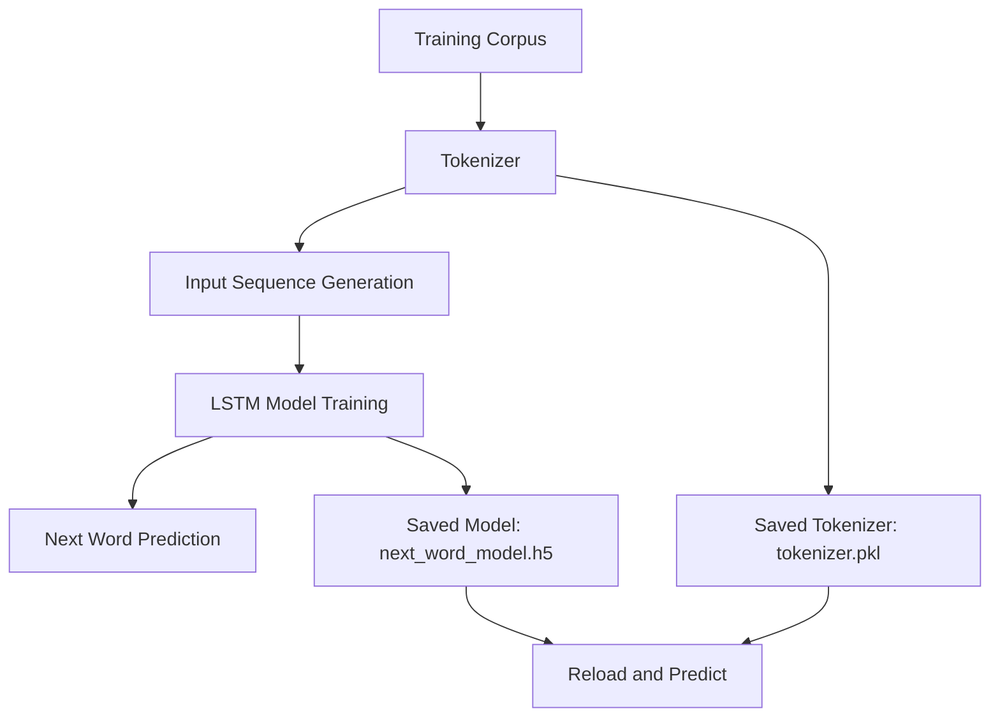

# Next Word Predictor

A notebook-based natural language processing project that trains a next-word prediction model using TensorFlow and Keras.

## Overview

This notebook demonstrates a basic NLP workflow:

1. Prepare a tiny training corpus
2. Build a tokenizer and vocabulary
3. Create input sequences for language modeling
4. Train an LSTM model to predict the next word
5. Save and reload the trained model and tokenizer

The project is intentionally simple so it can be understood, run, and modified easily inside VS Code or Jupyter.

## Architecture Diagram



## Features

- Notebook-based workflow for easy experimentation
- Tokenization and sequence preparation with Keras utilities
- LSTM model for next-word prediction
- Model and tokenizer persistence for reuse after training
- Git-friendly setup with ignored generated artifacts

## Project Structure

- `Next_Word_predictor.ipynb` - main notebook containing training and prediction workflow
- `README.md` - project documentation
- `requirements.txt` - Python dependencies
- `.gitignore` - excludes local environment files and generated model artifacts

## Requirements

- Python 3.10 or newer
- `numpy`
- `tensorflow`
- `ipykernel` for notebook execution in VS Code

## Setup

1. Create a virtual environment.
2. Install dependencies:

```bash
pip install -r requirements.txt
```

3. Open `Next_Word_predictor.ipynb` in VS Code or Jupyter.
4. Select the correct Python kernel.
5. Run the notebook cells from top to bottom.

## Usage

After training, the notebook predicts the next word for a short input phrase.

Example:

```text
Input: india is a
Predicted Next Word: great
```

You can also save the trained model and tokenizer for later use.

## Generated Files

Running the save cells creates these files in the project folder:

- `next_word_model.h5`
- `tokenizer.pkl`

These files are ignored by git so the repository stays clean.

## Notes

- The sample dataset is very small and is meant for demonstration only.
- Model quality will improve if you train on a larger and more diverse dataset.
- If TensorFlow imports are not resolving in VS Code, make sure the selected environment has the dependencies installed.
